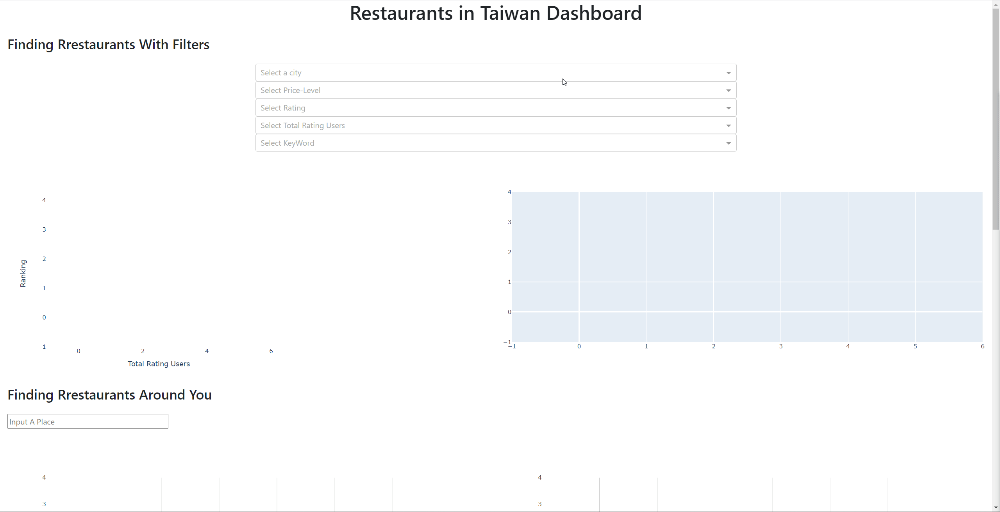
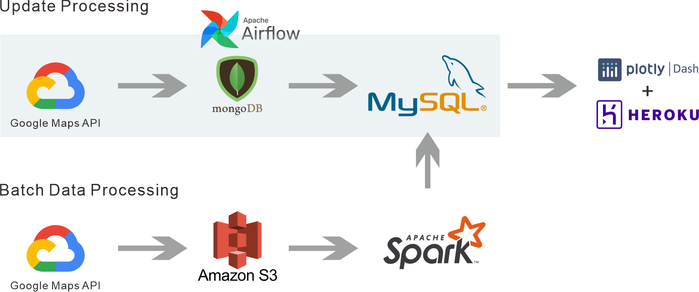
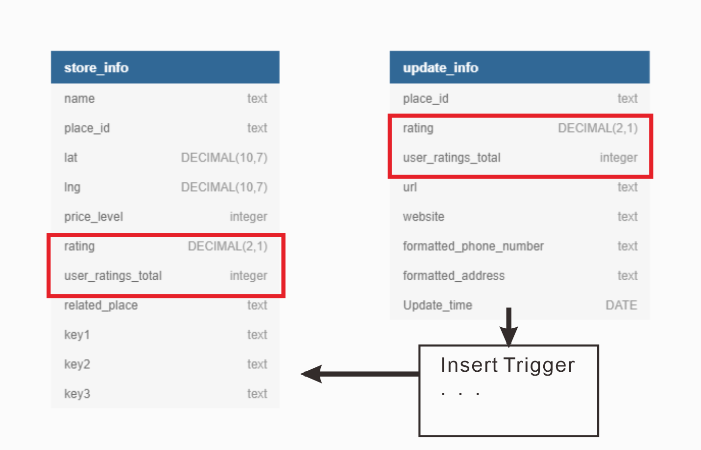

# Project_RestaurantsInTW
Collect infomation of restaurants in Taiwan through Google API.

## Goal
The primary goal of this project was to gain a deeper understanding of data engineering concepts and tools. This was achieved through collecting data from google map API, building batch and updating data processing and eventually show the results by the data visualization tools.

[Restaurants In Taiwan Website](https://restaurantsintw.herokuapp.com/)

## ETL Pipeline Overview

  There are two data processing pipelines in this project. One is collecting historic data and the other is updating the new data. Both data pipelines are collected into MySQL database and are shown by the Plotly Dash with HEROKU on website.

### The Process
#### Batch Data Processing
1. `GoogleAPI/RestFromGoogleAPI.py`: Python script to make requests from Google Map API by using “places_nearby” function. With entering a place name, searching radius and the type of place (“restaurant” was used in this project), each search result could generate maximum 60 places. Basically, the main purpose of this step is to gather as much restaurant as possible and store the data as csv files into AWS S3.

2. `Spark/AWS2Spark.py`: Python script to enable Apache Spark read csv files from AWS S3 into spark dataframe. With Spark, the data cleaning pipeline could execute work efficiently. Although the amount of data collected from the google API were low, it was still a good practice to gain more experience in using Spark.

#### Updating Processing
`Airflow/UpdataDagII.py`: 
The updating processing was scheduled by Airflow in every 20 minutes. To better help you understand what Airflow did for this project, here is a screenshot of the UI Airflow provides:

My data pipeline here is called “places_update_dag ” and there are 3 steps the pipeline does indicated by the circles:

1. `obtain_needed_placeid`:This function is to get the head 10 rows of restaurnts data ordered by the total user ratings in MySQL database which means the updating order is from the most popular place to the less.  

2. `insert_data2mongo`:After having the Json file data by the first step, the data would stored into MongoDB which is a Database for Json file data. 

3. `copy_data2mysql`: From the complete json data, extract the needed keys and valuse and store the data into local MySQL database.

As for the SQL schema, here is the schma figure of MySQL database:

#### Data Visualization
`PlotlyDash/WebShow.py`
Finally, the last step:  visualizing the data. Since most companies use a 3rd-party software like Tableau instead of Plotly to visualize the data, for me this step made me know much more about how to code the chart with the dataset.
